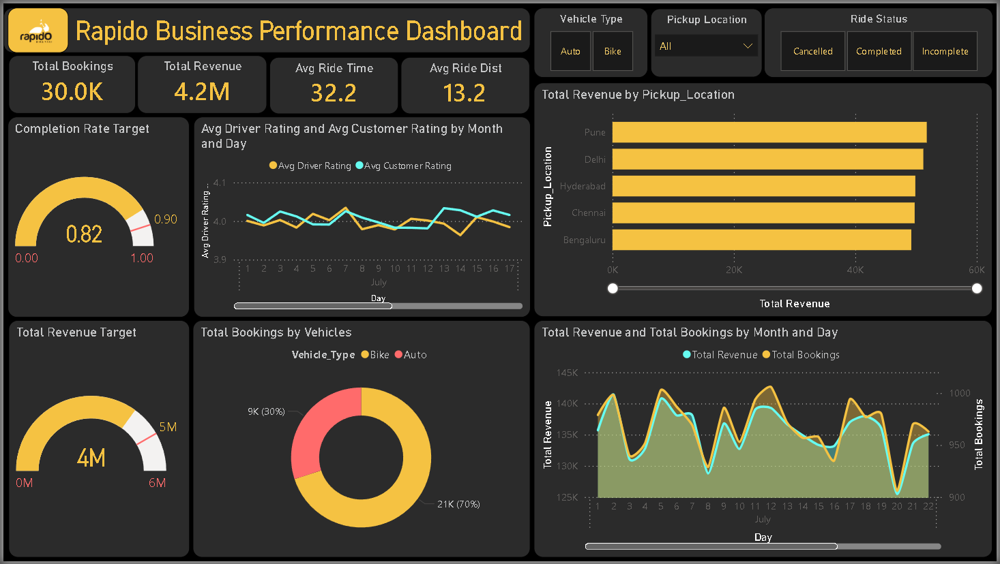
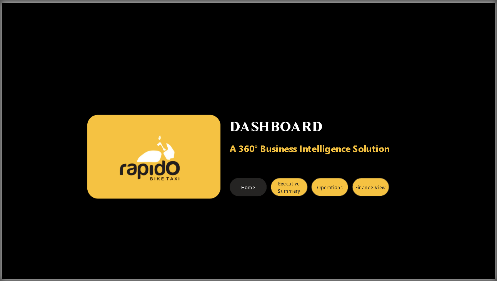

# Revenue Leakage & Fleet Optimization Suite

## 📋 Executive Summary
This project is a comprehensive **Diagnostic Analytics Simulation** designed to quantify operational friction in ride-hailing networks. Using a synthetic dataset of **30,000+ bookings**, the system models the financial impact of service failures, specifically identifying a **₹2.5 Lakh revenue leakage** opportunity.

The dashboard serves as a Decision Support System (DSS) moving beyond simple reporting ("How many rides?") to diagnostic analysis ("Where did we lose money?").

## 🛑 Business Problem
High-volume ride-hailing operations often suffer from "silent" revenue bleed caused by operational inefficiencies.
* **Churn Correlation:** High wait times directly correlate with cancellation rates.
* **Asset Mismatch:** Fleet supply (Auto vs. Bike) often mismatches demand peaks.
* **Quantification Gap:** Operational metrics (Wait Time) are rarely mapped directly to Financial Impact (Revenue Loss) in real-time.

## 💡 Key Insights (The "So What?")
Based on the July 2025 performance data:

1.  **The Tipping Point:** A **17-minute Average Wait Time** in high-demand zones correlated with an **11.9% Cancellation Rate**.
2.  **Financial Impact:** This operational friction resulted in a simulated opportunity cost of **₹2,51,900** (Revenue Leakage).
3.  **Digital Adoption:** **49.9%** of transactions are via UPI, suggesting a successful push for digital payments to reduce cash-handling friction.
4.  **Strategic Solution:** Identified specific "Churn Zones" where geo-fenced driver incentives could reduce wait times below the 17-minute threshold.

## 🛠️ Technical Architecture
* **Core Engine:** Microsoft Power BI
* **Query Language:** DAX (Data Analysis Expressions) for measure calculation.
* **Key Measures:** Built 13 calculated measures including `Revenue Efficiency`, `Churn Rate`, and `Opportunity Cost`.

### UX & Interface Design
Designed with an App-like navigation structure (Home -> Ops -> Finance) and Dark Mode optimization for high-contrast Operations Command Centers.

## 📂 Project Structure
* `solution_architecture/`: Contains the production-ready `.pbix` file.
* `docs/`: Detailed project presentation and PDF summaries.
* `output/`: High-resolution captures of the dashboard interface.

## 🎓 Credits
* **Institution:** WeSchool (Welingkar Institute of Management)
* **Mentor:** Dr. Aradhana Goutam
* **Team:** Sanjana Aravind, Nasir Mansuri, Surabhi Gade, Purva Kulkarni, Nikil Verma, Anshul Silhare

---
*Author: Anshul Silhare | Operations & Supply Chain Analytics*
*Note: This is an academic project based on a synthetic dataset for educational purposes.*
